# Socialzr - Not Just Another Event App

Full Stack Application using MERN Stack, Designed and Development by:  
Stephanie Hales
  
Phillip Yoo
  
Dax Scholtz 

## Purpose

The purpose of this application is to allow people wanting to attend events of all kinds, an easier way to manage their yearly festive events. It aims to connect like minded people, provide local event listings which may not be listed on social media platforms, and share events we all come across. 

## Functionality / Features

#### Login/Register Form and Authentication
This is a simple form to allow the user to register and/or login to view additional information and attend or host events. 

#### Navigation 
There will be a navigation bar to allow user to navigate throughout the application with ease. 

#### Search/Filter
The search / filter will allow users to find events based on their location. 

#### Create Event Form
This form will allow the host to input the basic information to set up the event 

#### Edit/Delete Event
This function will allow the owner of the event to make changes or delete the event. 

#### Profile Page
This profile page has been designed with the fear of missing out culture in mind, and include personalised account details such as a profile image, bio and links to social media and website. 

#### User Accounts
There are two levels of accounts, Host, and Attendee. Users will be able to discover friends and like-minded event attendees. 

#### Event List
The event list will allow people to discover festivals, events, and parties. This is open to both user accounts and people browsing the app. To attend an event, an account will need to be created. 

#### A "favorites" or "My Events" list
This will allow users to create a list of their favourite events, and receive notifications when event tickets are on sale. 

#### Comment/Rate 
The user will be able to comment and rate an event they attend. This will allow other people to gauge whether they want to attend a future event, it will also make sure the host maintains the quality of their events. 

## Target audience

This application has been designed for people of all ages, creeds, and colours. The functionality has been further developed to incite people with busy lives, who still want to attend upcoming events, and have the ability to add it to their personal calendar. Those 'early birds' have not been forgotten, the notification for sale tickets allows people wanting to get the best deal, as well as students living on that 2-minute noodle diet to get a good deal for the next event they've been waiting for. Everyone attends events, so this application is for anyone who enjoys connecting with others. 

## Tech stack

- MongoDB 
- Express.js
- React
- Node.js
- Mongoose 
- Heroku
- Netlify 

## Data Flow Diagram

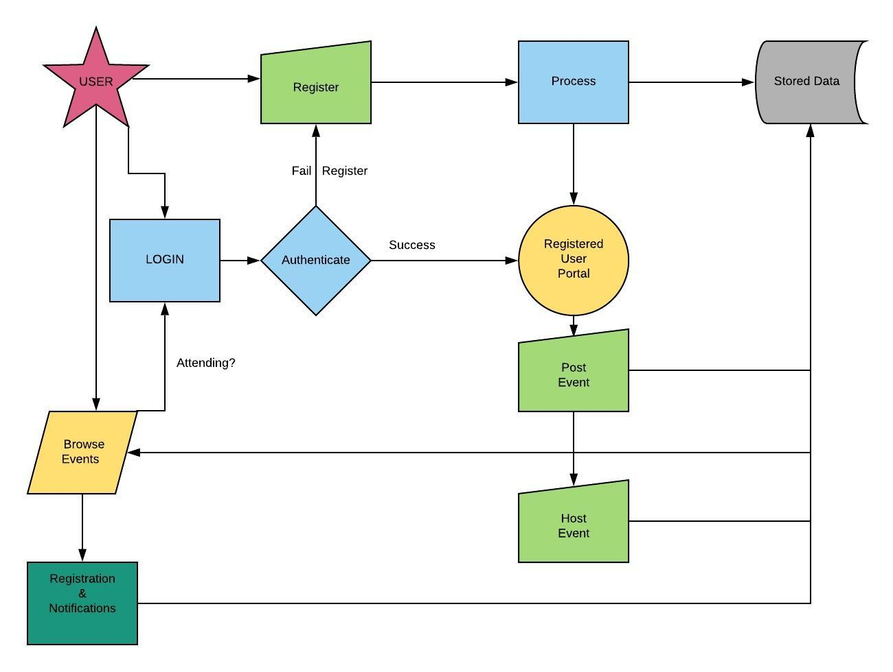

## Application Architecture Diagram

## User Stories

| Attendee | Host |
| --- | ----------- |
| As an attendee, I would like to be able to search for events, so that I don't miss specific events | As a host, I would like to create an event, so that I can hold an event | 
| As an attendee, I would like to rate and comment events, so that people can share their knowledge and experience about events and be more informed. | As a host, I would like to be able to collect payment from attendees, so that I can pay for food/drinks upfront. 
| As an attendee, I would like to see my saved events in a calendar, so that I can visualise my upcoming events | 
| As an attendee, I would like to save my favourite parties/festivals in one place, so that I can plan my festivities for the year. | 
| As a an attendee, I would like to get email notifications, so that I can purchase tickets when they go on sale. | 
| As an attendee, I would like to see a description about the event, so that I can be prepared. | 
| As an attendee, I would like to be able to browse local events, so that I don't miss out on events. | 
| As an attendee, I would like to be recommended meeting people who attend the same events, so that I can meet like minded people. |

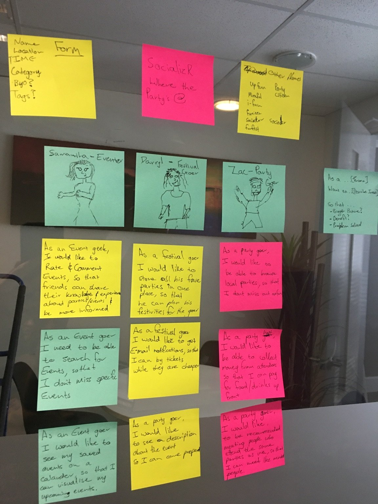

## Wireframes 

The below wireframes were created using Figma Design 

### Desktop Wireframes
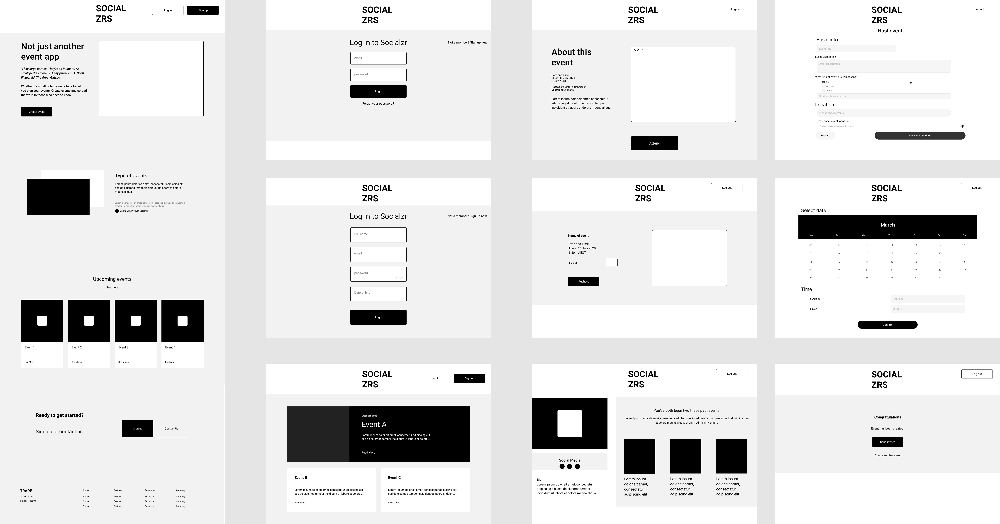

### Mobile Wireframes

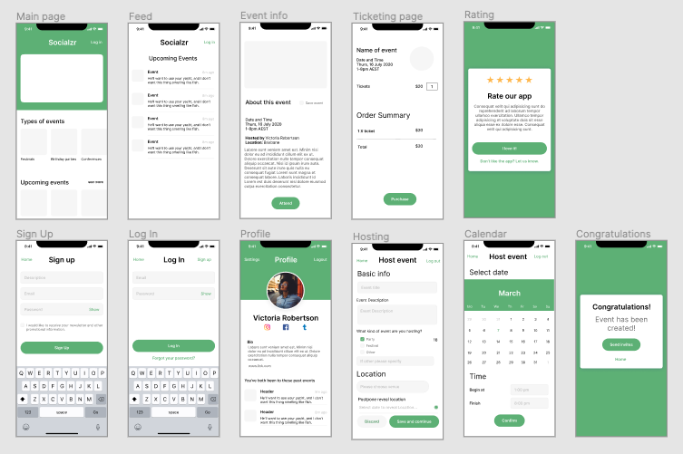

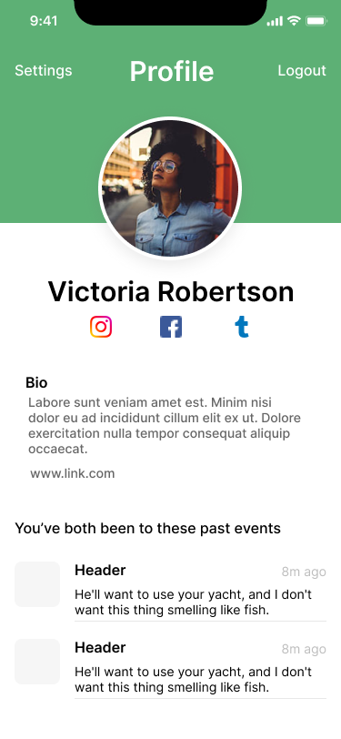

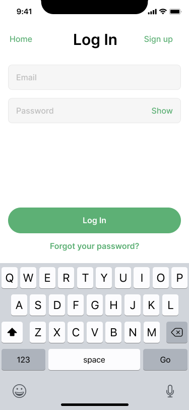

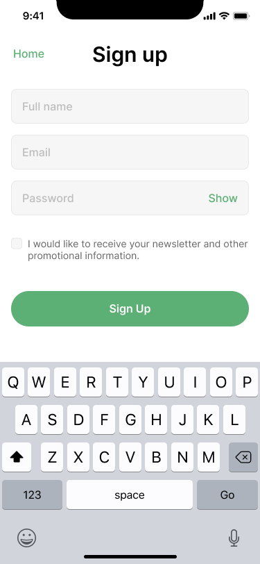

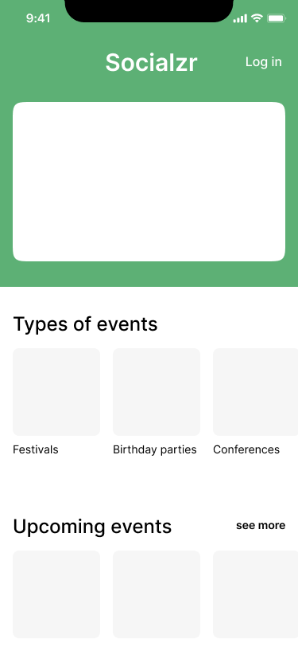

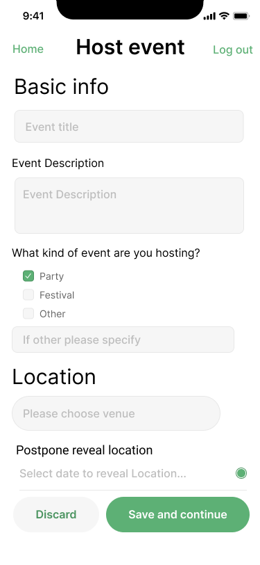

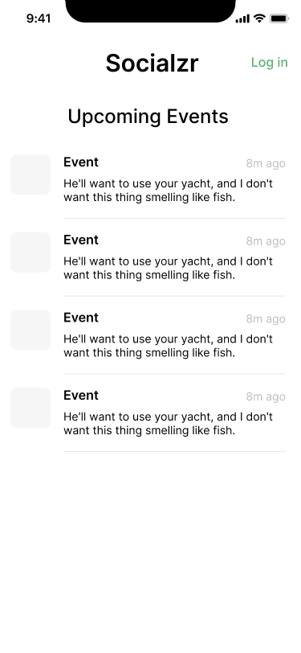

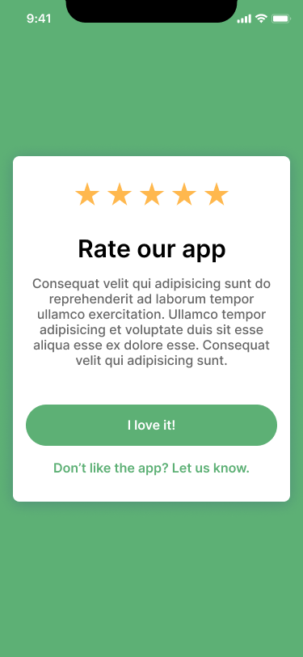

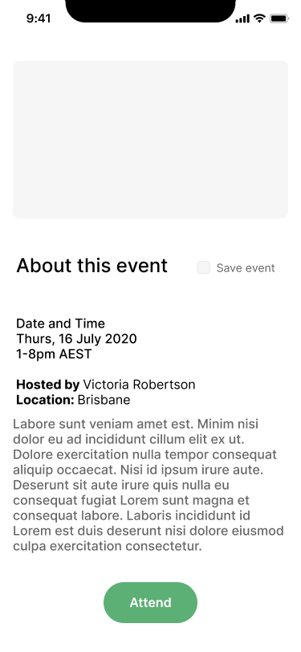

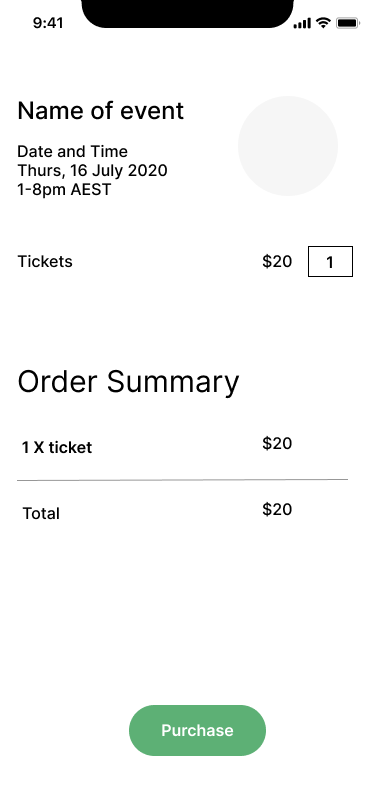

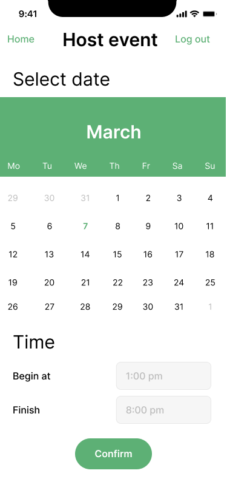

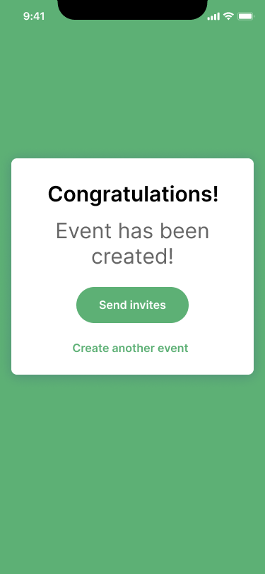

## Trello Board